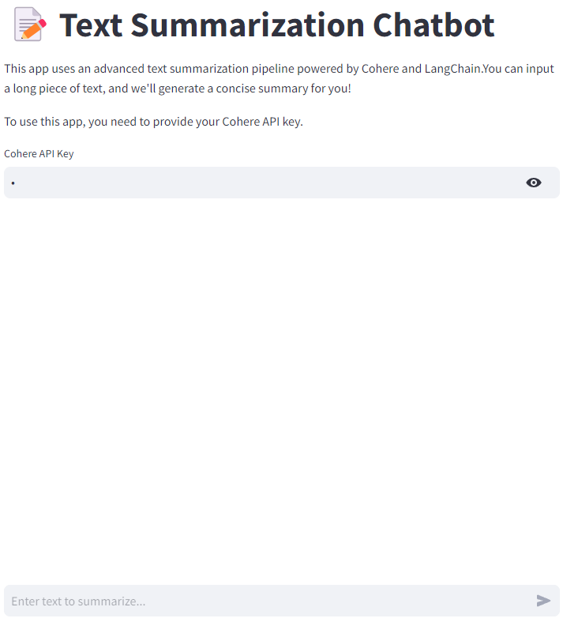

[](https://github.com/Ghouma-workspace/Summerization_LangChain/actions/workflows/CI-testing.yml)
[]

# Summarization using LangChain

A Python-based project for text summarization using Cohere and LangChain.  
This project includes a **Streamlit web app** for summarization and provides a modular library for inference.  
The project is well-structured and includes testing, linting, and formatting.

## Features
- **Streamlit Web App**: A user-friendly interface for text summarization.
- **Cohere Integration**: Uses Cohere's API for summarization tasks.
- **LangChain**: Modularized pipeline for chunking, formatting, and summarization.
- **Testing**: Comprehensive tests for both inference and library components.
- **Code Quality**: Linting and formatting tools included.

## Project Structure
```
SUMMARIZATION_LANGCHAIN  
├── summarization_lib/  
│   ├── __init__.py                # Library initialization  
│   ├── core.py                    # Core summarization logic  
├── stream_chat/  
│   ├── app.py                     # Streamlit app for summarization  
│   ├── summarization_inference.py # Inference logic  
├── tests/  
│   ├── test_summarization_inference.py  # Test suite for inference  
│   ├── test_summarization_lib.py        # Test suite for summarization package  
├── Makefile                        # Automation of common tasks  
├── buildspec.yml                   # Set up AWS CodeBuild  
├── requirements.txt                # Python dependencies  
├── setup.py                        # Package setup file  
└── summarization_inference.py      # On terminal inference  
└── README.md                       # Project documentation  
```

## Requirements
- Python 3.10 or higher
- Cohere API Key

## Installation
To install the project and its dependencies, run:  
**make install**

## Usage
### Run Streamlit App
Start the Streamlit web app for text summarization:  
**make inference-streamlit**  
Visit the app at `http://localhost:8501`.  
Below is a preview of the app interface.  
<div>
    
</div>

### Call summarization_inference.py file
Use the inference python file directly from the terminal:  
**python summarization_inference.py <input_file> <api_key>**

## Commands
| Command                | Description                                             |
|------------------------|---------------------------------------------------------|
| `make install`         | Install dependencies and set up the project.            |
| `make inference-streamlit` | Run the Streamlit web app.                       |
| `make test`            | Run all tests with detailed output and coverage.        |
| `make debug`           | Debug tests using the Python debugger.                  |
| `make inference-test`  | Run a specific test for summarization inference.        |
| `make format`          | Format code using `black`.                              |
| `make lint`            | Lint code using `pylint`.                               |
| `make all`             | Install, lint, test, and format the codebase.           |

## License
This project is licensed under the MIT License. See the `LICENSE` file for more details.

## Acknowledgements
- [Cohere](https://cohere.ai) for their API.
- [LangChain](https://langchain.com) for modular pipeline tools.
- [Streamlit](https://streamlit.io) for the user-friendly web app framework.
